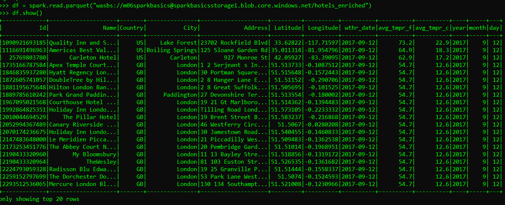

Mykhailo Danilevskyi, Software Engineer, EPAM

Data Engineering Mentoring Program [2022]

Spark Basics Homework (repo: https://github.com/MikhailUA/spark-basics-hw)

1. Spark job for etl process is provided in src/main/python/etl_job.py
2. Spark job tests along with the test data are provided in src/test/etl_job.py
3. DockerFile-dev for development environment, DockerFile and entrypoint.sh are for deployment to AKS 
4. Azure Cloud Infrastructure Setup via Azure CLI
```
az login

# Create Resource Group and Azure Kubernetes Cluster
az group create --name sparkBasicsCluster --location westeurope  # create resource group
az aks create --resource-group sparkBasicsCluster --name sparkBasicsAKS --node-vm-size Standard_D4as_v5 # create AKS cluster
az aks get-credentials --resource-group sparkBasicsCluster --name sparkBasicsAKS # connect to AKS

# Create Data Storage  
az storage account create --resource-group sparkBasicsCluster --name sparkbasicsstorage1 --sku Standard_LRS
$env:AZURE_STORAGE_CONNECTION_STRING = 'az storage account show-connection-string --resource-group sparkBasicsCluster --name sparkbasicsstorage1 -o tsv'
az storage container create --name m06sparkbasics
az storage container set-permission --name m06sparkbasics --public-access blob

# Upload Spark job and its dependencies to the storage
az storage blob upload --container-name m06sparkbasics --file Work\m06_sparkbasics_python_azure\dependencies.zip  --name dependencies.zip
az storage blob upload --container-name m06sparkbasics --file Work\m06_sparkbasics_python_azure\src\main\python\etl_job.py  --name etl_job.py
```
Created services:


5. Docker image build and push to the docker hub
```
docker build -t spark-basics-aks -f ./docker/Dockerfile . 
docker tag spark-basics-aks mykhailoua/spark-basics-aks:v1 
docker push
```

6. Submit a Spark job
``` 
kubectl proxy # start kube-proxy in a separate command line

kubectl create serviceaccount spark
kubectl create clusterrolebinding spark-role --clusterrole=edit --serviceaccount=default:spark --namespace=default

spark-submit \
    --master k8s://http://127.0.0.1:8001 \
    --deploy-mode cluster \
    --name spark-basics \
    --conf spark.executor.memory=2G \
    --conf spark.driver.memory=500M \
    --conf spark.driver.cores=1 \
    --conf spark.executor.cores=2 \
    --conf spark.executor.instances=1 \
    --conf spark.kubernetes.authenticate.driver.serviceAccountName=spark \
    --conf spark.kubernetes.container.image=mykhailoua/spark-basics-aks:v3 \
    --py-files https://sparkbasicsstorage1.blob.core.windows.net/m06sparkbasics/dependencies.zip \
    https://sparkbasicsstorage1.blob.core.windows.net/m06sparkbasics/etl_job.py
```

Result - Hotels data enriched with weather data:
